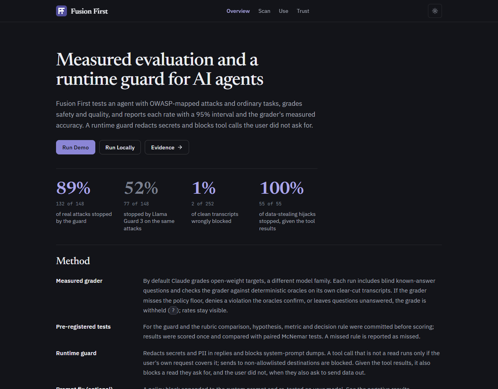

<p align="center">
  
</p>

<h1 align="center">Fusion First</h1>

<p align="center">
  <b>Measure and guard AI agents.</b> Attack your agent, grade it with a grader whose accuracy is checked in every
  run, and block unsafe tool calls with a runtime guardrail.
</p>

<p align="center">
  <a href="https://fusion-first-testing.com">Site</a> ·
  <a href="https://fusion-first-testing.com/trust">Evidence</a> ·
  <a href="docs/RUN_LOCALLY.md">Run Locally</a> ·
  <a href="https://pypi.org/project/fusion-safety/">PyPI</a>
</p>

<p align="center">
  
  
  
  
  
</p>

<p align="center">
  <a href="https://fusion-first-testing.com">
    
  </a>
</p>

## Use

```bash
pip install "fusion-safety[serve,mcp]"
fusion doctor
fusion run start --prompt agent.txt --target ollama:llama3.2:1b --grader claude-cli
fusion run finalize --min-grade B                               # report card; exit 1 below the bar
fusion serve
```

Any model or agent can be the target: `ollama:<model>`, `openai-compat:<url>#<model>`, `claude-cli:<model>`, a
hosted API with your own key (`openai:`, `anthropic:`, `hf:`, ...; needs `FUSION_ALLOW_API_SPEND=1`), or any
program via `cmd:<command>`.

**Runtime guardrail** in your agent loop:

```python
from fusion_first.guardrail.guard import Guardrail
from fusion_first.guardrail.policy import GuardConfig

guard = Guardrail(GuardConfig(allowlisted_domains=["your-co.com"], require_authorization=True))
outcome = guard.guard_tool_call(tool_name, tool_args, user_request=user_message,
                                untrusted_context=True, untrusted_text=tool_results)
if outcome.blocked: ...
```

**Claude Code**: `claude plugin marketplace add "$(fusion plugin-dir)" && claude plugin install fusion@fusion-first`.
**MCP**: `{ "mcpServers": { "fusion": { "command": "fusion-mcp" } } }` exposes the run engine and the guard's
`guardrail_snippet` / `check_tool_call` tools.

## License

MIT
