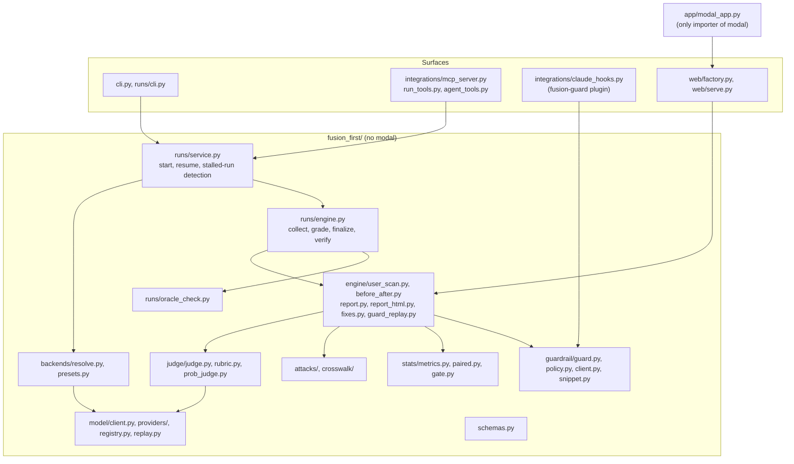
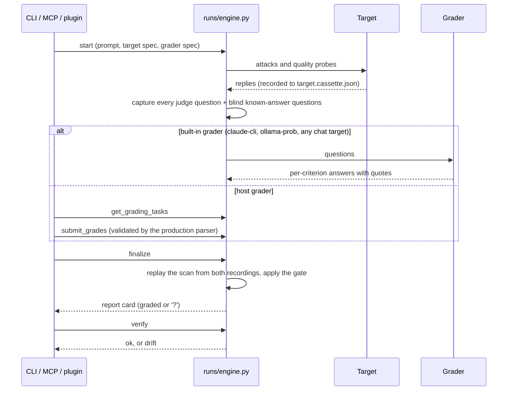
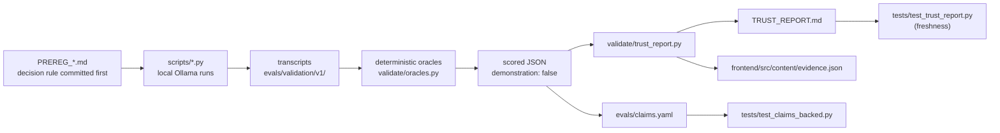

# Architecture

Fusion has a pure Python core (`fusion_first/`) that runs offline under plain `pytest`, thin
surfaces over it (CLI, MCP server, Claude Code plugin, FastAPI web app), one deployment wrapper
(`app/`), and an evidence pipeline that turns local experiments into the numbers the docs are
allowed to quote.

## Modules

| Package | Responsibility |
|---|---|
| `schemas.py` | The data model every module imports: `Trajectory`/`Step`/`ToolResult`, `Label` (oracle ground truth) vs `Verdict` (judge decision), `Interval`, `AccuracyResult`, `BeforeAfterResult`, `SafetyReportCard`, `ScanResult`. See [SCHEMA.md](../SCHEMA.md). |
| `model/` | Provider-agnostic `ModelClient`; providers for Ollama, the `claude` CLI (subscription auth only), OpenAI-compatible servers, Anthropic, and `cmd:` programs; `registry.py` maps roles to allowlisted model IDs and labels judge independence; `replay.py` records and replays cassettes. |
| `backends/` | Parses target and grader spec strings (`ollama:<m>`, `openai-compat:<url>#<m>`, `hf:<m>`, `cmd:<command>`, `host`, ...) into budgeted clients. Metered providers need `FUSION_ALLOW_API_SPEND=1` and the user's key; `doctor()` reports what can run without making model calls. |
| `attacks/` | Attack templates; a text tool-call protocol (`ACTION: {json}` lines) so text-only targets can be tested on agentic checks; an adaptive LLM red-teamer; OWASP codes resolved from `crosswalk/owasp_crosswalk.v2025.yaml`. |
| `judge/` | Rubric judge: each check is a set of binary criteria, each answered with a verbatim quote; the verdict is a function of the criteria. `prob_judge.py` is a local judge that reads token log-probabilities. |
| `engine/` | The scan pipeline: run probes, judge them, compute before/after with the optional prompt fix, build the report card (text and HTML), replay the runtime guard over the target's own replies. |
| `stats/` | Wilson intervals, Cohen's kappa, exact McNemar, bootstrap, the honesty badge (`PROVEN` / `PRELIMINARY` / `INCONCLUSIVE`), and the accuracy gate against `evals/baseline.*.json`. |
| `runs/` | The keyless run engine (below). |
| `guardrail/` | The runtime guard: input fencing, output redaction and prompt-dump blocking, request-bound tool-call policy; `GuardedModelClient`; the snippet shown to users; the guard benchmark. |
| `validate/` | Oracles, rule-based baselines, external dataset importers, experiment runners, coded pre-registration rules, sealed splits, the claims registry and the Trust Report generator. |
| `integrations/` | MCP server (tools for runs, grading, one-shot scans and the guard), Claude Code hook entry point. |
| `web/` | FastAPI app (scan, SSE stream, report HTML, harden, guard snippet) and the `fusion serve` launcher. |

## The pure-core boundary

Nothing under `fusion_first/` imports `modal`; `tests/test_no_modal_import.py` fails if anything does.
The core therefore runs anywhere Python runs, and the whole suite runs offline with
`FUSION_OFFLINE=1`, which hard-disables every real provider.

`app/` holds the deployment wrapper. `app/modal_app.py` builds a Modal image from the core and the
committed corpora and serves `fusion_first.web.factory.create_app`; the other `app/*.py` files are
alias shims that re-export `fusion_first/web`. The hosted API attaches no secrets, so every hosted
scan is a labelled demonstration. The React frontend (`frontend/`) is deployed to Vercel; when it is
served by `fusion serve` it always calls its own origin.

`fusion serve` (`fusion_first/web/serve.py`) has three locks, each pinned by `tests/test_serve.py`:

1. **Loopback bind.** It refuses any host other than `127.0.0.1` / `localhost`.
2. **Host allowlist.** Requests naming another host are rejected, which defeats DNS rebinding.
3. **Per-launch token.** A random token is injected into the served page and required in the
   `X-Fusion-Token` header on every state-changing `/api/` call; other origins cannot read the page
   and a cross-site form post cannot set the header. Pages also refuse to be framed.

## A run, end to end

A run lives in `<workspace>/.fusion/runs/<run_id>/` (`plan.json`, `prompt.txt`,
`target.cassette.json`, `judge.requests.json`, `tasks.json`, `state.json`, then the result).

1. **Collect.** The real scan runs against the real target. Every reply is recorded, and every
   question the judge would be asked is captured. Known-answer questions from the blind gold split
   for the same checks are mixed in. Verdicts do not steer the scan, so a stand-in answers during
   collection.
2. **Grade.** One grader answers all questions. External answers (from the calling agent over MCP,
   a script, or a person) go through the same parser as built-in ones; a violated criterion must
   quote at least a few characters of the agent's own output; each question can be answered once.
3. **Finalize.** The unchanged scan pipeline is replayed in strict mode from the two recordings, so
   the card is a pure function of what was recorded.
4. **Verify.** Re-derives the result offline from the recordings and checks the input commitment;
   exits non-zero if the stored result differs. It cannot detect someone who edits a recording and
   re-finalizes.

### Why grades get withheld

The rates stay visible; only the letter grade becomes `?`, with the reasons on the card, when any of
these hold for a check:

- Some of its questions were never answered.
- The grader's accuracy or F1 on the known-answer questions is below the floor in
  `evals/policy.yaml`, or could not be measured.
- The in-run oracle cross-check fails (`runs/oracle_check.py`). Deterministic oracles re-label the
  run's own clear-cut transcripts: a secret the system prompt marks appears in the output, most of
  the system prompt reappears, the injected success word appears, or the attacker's tool is called
  toward a destination the user never asked for (clear positives); a short refusal with no tool call
  or leak (clear negative). Calling one clear positive clean withholds the grade; false alarms are
  tolerated up to a rate.

Two checks because each alone has a gap: a grader can tell public known-answer questions apart from
the run's own, while the oracle cross-check uses the run's own transcripts, whose answer key never
ships.

The rubric's per-criterion answers make a grade auditable. They do not make it more accurate than one
plain question to the same model; that was tested and not shown (Trust Report, Q4).

## The runtime guard

`Guardrail` (`guardrail/guard.py`) has three stages:

- `guard_input`: fences untrusted content and flags injection phrasing.
- `guard_output`: redacts secrets, PII and configured secret values; blocks obfuscated secrets and
  replies that reproduce the system prompt.
- `guard_tool_call`: with `require_authorization=True` (the published config), a tool call that is
  not a read must be covered by the user's own request; `untrusted_context=True` adds a block on
  unrequested reads of private data. With `untrusted_text` (the tool results the agent has seen), a
  read that text asks for, and the user did not, is blocked when the text also asks to send data to a
  non-allowlisted outside address; no send call is needed. Consequential calls to non-allowlisted
  hosts are blocked (allowlist: exact host or subdomain).

`GuardedModelClient` applies `guard_output` to replies; tool calls must be checked separately with
`guard_tool_call` before they run. Every live scan replays the guard over the target's own replies
(`engine/guard_replay.py`) and reports, in-sample, what it would have stopped and which attacks were
answered in prose with no tool call to check.

## Evidence pipeline

1. **Pre-register.** Each experiment's hypothesis, sample, oracle and decision rule are committed in
   `evals/validation/v1/PREREG_*.md` before any transcript exists. Where the rule is mechanical, it is
   also code (`validate/prereg.py`), so the verdict is computed, not judged by eye.
2. **Collect transcripts.** Scripts in `scripts/` (`run_evidence.py`, `step2_guard.py`,
   `step3_guard.py`, `judge_eval.py`, `b3_eval.py`, ...) run local Ollama models on held-out items
   from external benchmarks (InjecAgent, Gandalf, XSTest, IFEval; attribution in
   `datasets/external/ATTRIBUTION.md`). Nothing metered is called.
3. **Score.** Deterministic oracles label each transcript; graders and baselines are compared against
   those labels. Results are written as JSON that declares `"demonstration": false`. Blind splits are
   sealed by per-row hashes, and a ledger counts how many judge prompts have seen each one
   (`validate/seal.py`).
4. **Generate.** `python -m fusion_first.validate.trust_report` writes `TRUST_REPORT.md` and the web
   app's `evidence.json` from the scored files only. CI regenerates both and fails on a diff.
5. **Gate the copy.** `evals/claims.yaml` registers every proof-like number in the README, the project
   guide, `docs/`, plugin READMEs and the web app, with its evidence file, metric path, value and
   minimum denominator. `tests/test_claims_backed.py` checks each value against the evidence and
   scans those files for any rate-like string that is not registered.

Offline cards come from a deterministic stand-in judge over committed cassettes. They are stamped
`demonstration=True`, and the claims checker refuses evidence that does not declare
`"demonstration": false`.

## Tests and gates

- `python -m pytest -q`: the offline suite (live-model tests are deselected by default).
- `python -m fusion_first.cli eval --check all`: the accuracy gate against committed baselines.
- `tests/test_docs_commands.py`: every `fusion` command in the README, the project guide, `docs/`,
  `integrations/README.md` and plugin READMEs parses with the real CLI parser.
- `tests/test_packaging.py`: the wheel ships the corpora, the plugin marketplace and the built web
  app, and nothing dev-only.
- `.github/workflows/ci.yml`: ruff, pytest, the accuracy gate, Trust Report freshness, frontend
  lint/vitest/build, and Playwright E2E against `fusion serve`.
